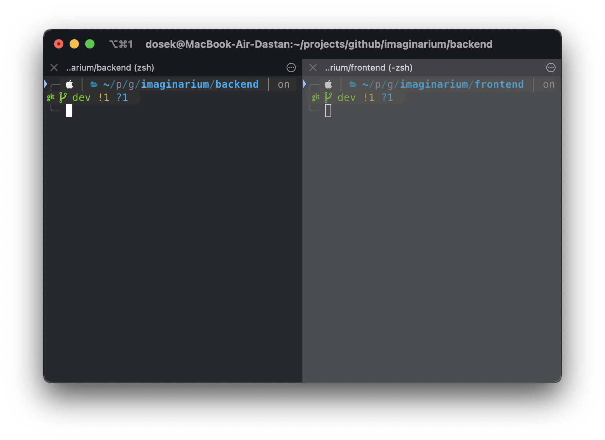

<h2 align="center">
  
</h2>

<h4 align="center">~ An image-editing web-app for developers, by developers.</h4>

## Setting up to run.
We strongly recommend using 2 separate terminals to launch the app (as in example)



### Code
```zsh
# Download the code using git:
git clone https://github.com/imaginaryguys/imaginarium/
```

---

### Backend
```zsh
# Install pipenv:
$ pip install pipenv

# Create a new virtual environment:
$ pipenv shell

# Install dependencies:
$ pipenv install

# Run server:
$ cd backend
$ python manage.py runserver
```

---

### Frontend
```zsh
# Install dependencies:
$ npm install

# Run frontend:
$ cd frontend
$ npm start
```
